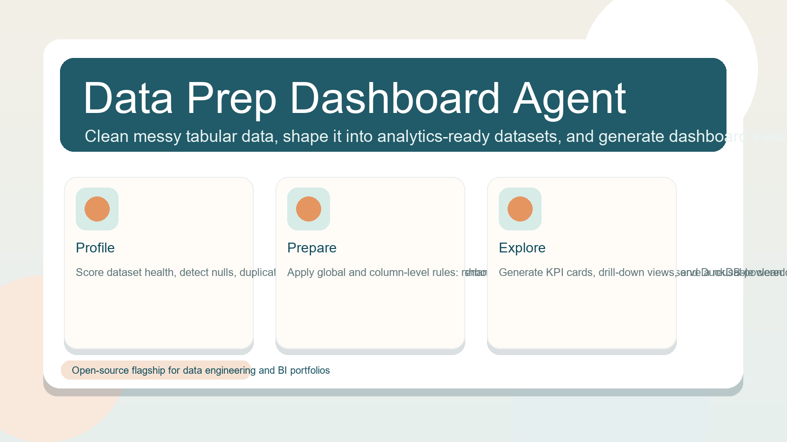
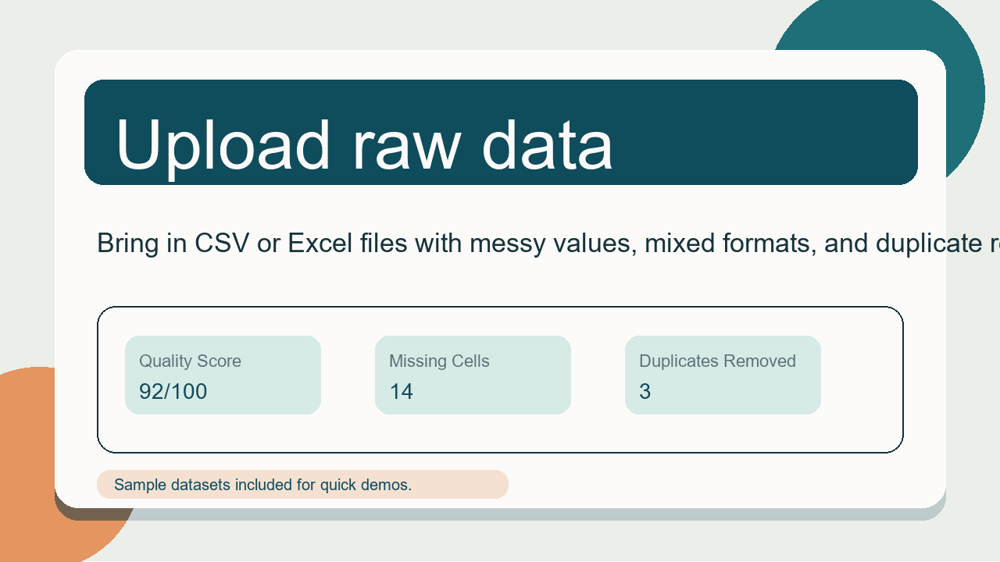
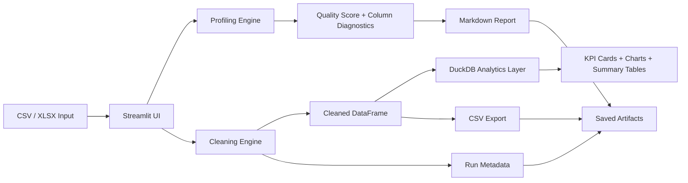

# Data Prep Dashboard Agent



An open-source analytics workspace for turning messy tabular data into dashboard-ready outputs.

Data Prep Dashboard Agent combines data cleaning, profiling, dashboard generation, and repeatable export workflows in one Streamlit application. It is designed as a flagship portfolio project for data engineering, analytics engineering, and BI-focused roles.



## Why it stands out

- Starts with raw CSV or Excel files instead of clean demo data.
- Scores dataset health before analysis begins.
- Supports both global cleaning rules and column-level actions.
- Uses DuckDB-backed summaries to make dashboard generation feel fast and analytical.
- Saves run artifacts so analysis is not trapped in a one-time UI session.
- Ships with test data, unit tests, and Docker support.

## Core capabilities

- Upload `.csv` and `.xlsx` datasets.
- Profile missing values, duplicates, outliers, inferred types, and dataset quality score.
- Apply cleaning rules such as trimming whitespace, normalizing missing markers, casting numeric or datetime columns, filling nulls, lowercasing text, renaming fields, and dropping low-value columns.
- Compare raw and cleaned data side by side.
- Build quick KPI views and configurable dashboards from cleaned data.
- Save cleaned CSVs, markdown reports, and run metadata under `reports/`.
- Test locally with sample messy datasets from retail, HR, support, and inventory domains.

## Feature walkthrough

1. Upload a raw dataset or start from one of the included messy sample files.
2. Inspect the health score, missing values, inferred types, and outlier indicators.
3. Apply global cleanup settings from the sidebar.
4. Fine-tune individual columns with rename, type conversion, fill strategy, lowercase, and drop controls.
5. Build charts from selected metrics, dimensions, and date fields.
6. Export cleaned data and save repeatable run artifacts.

## Architecture



## Project structure

```text
data-prep-dashboard-agent/
  app/
    __init__.py
    dashboard.py
    data_processing.py
    final_dashboard.py
    final_engine.py
    persistence.py
    ui.py
  data/
    sample_sales_messy.csv
    messy_retail_orders.csv
    messy_hr_attrition.csv
    messy_support_tickets.csv
    messy_inventory_supply.csv
  docs/
    assets/
      hero-banner.png
      feature-tour.gif
  reports/
  tests/
    test_final_engine.py
  Dockerfile
  streamlit_app.py
  requirements.txt
  README.md
```

## Tech stack

- Python
- Streamlit
- pandas
- DuckDB
- Plotly
- Pillow
- unittest
- Docker

## Getting started

```bash
cd data-prep-dashboard-agent
python -m venv .venv
.venv\Scripts\activate
pip install -r requirements.txt
streamlit run streamlit_app.py
```

Open the app at `http://localhost:8501`.

## Run tests

```bash
python -m unittest discover -s tests
```

## Run with Docker

```bash
docker build -t data-prep-dashboard-agent .
docker run -p 8501:8501 data-prep-dashboard-agent
```

## Included sample datasets

- `data/sample_sales_messy.csv`
- `data/messy_retail_orders.csv`
- `data/messy_hr_attrition.csv`
- `data/messy_support_tickets.csv`
- `data/messy_inventory_supply.csv`

These files include mixed date formats, duplicates, nulls, inconsistent casing, numeric text, placeholder values, and messy categories so the workflow can be tested realistically.

## Roadmap

### Phase 1: Product polish

- Add richer chart layout controls and saved dashboard presets.
- Improve error messaging for invalid type coercions and fill rules.
- Add downloadable JSON summaries for every run.

### Phase 2: Data quality depth

- Integrate Pandera or Great Expectations.
- Add schema drift checks and freshness rules.
- Introduce anomaly flags and threshold alerts.

### Phase 3: Persistence and collaboration

- Persist runs in SQLite or Postgres.
- Add authentication and project workspaces.
- Add reusable transformation templates across datasets.

### Phase 4: Analytics engineering expansion

- Export curated outputs for Superset or Metabase.
- Add dbt-ready model exports.
- Add scheduled profiling jobs and notification hooks.

## Why this is a strong portfolio project

- It solves a real workflow instead of a single isolated feature.
- It sits between data cleaning, BI, and analytics engineering.
- It demonstrates product thinking, not just notebook analysis.
- It is easy to demo quickly but still has a credible production path.

## Future extensions

- LLM explanations for detected data issues
- natural-language chart generation
- SQL editor over cleaned DuckDB tables
- automated data contracts
- team sharing and review workflows
